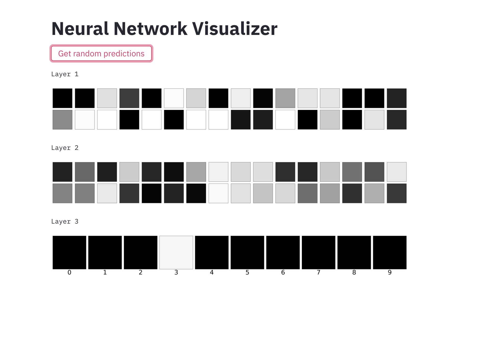

# NN-Visualizer-Site
 Web based visualization of neural network prediction using keras and streamlit
 
 

## Running the program
1. Train the model and download the model weights as `model.h5`.
2. Start the flask server using `python ml_server.py`.
3. While the flask server is running, in a new terminal activate the virtual environment and run streamlit server using `streamlit run app.py`
